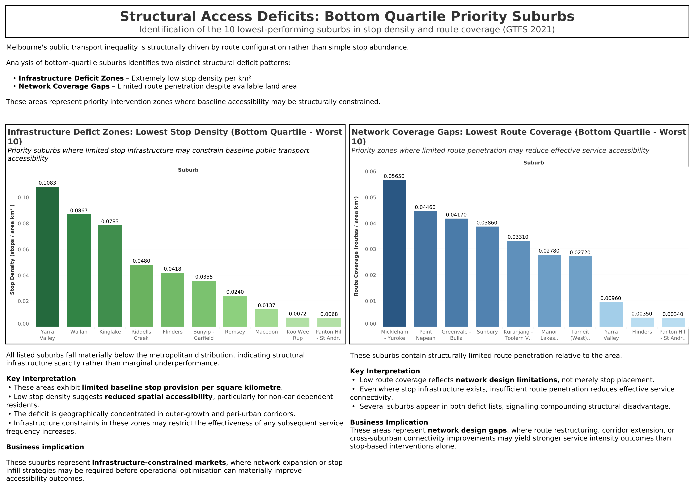
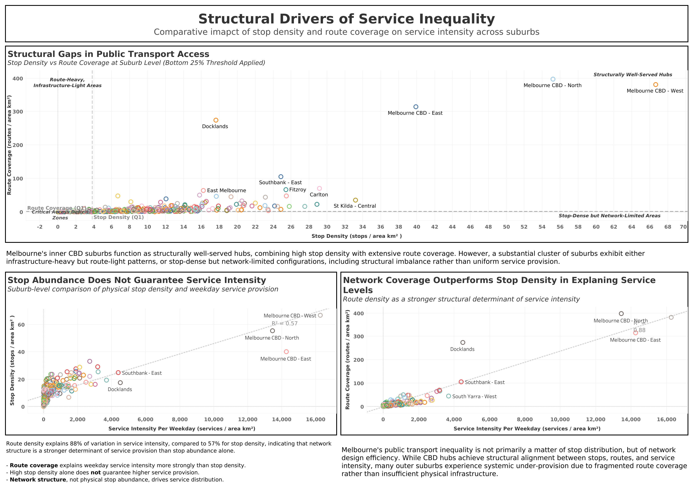
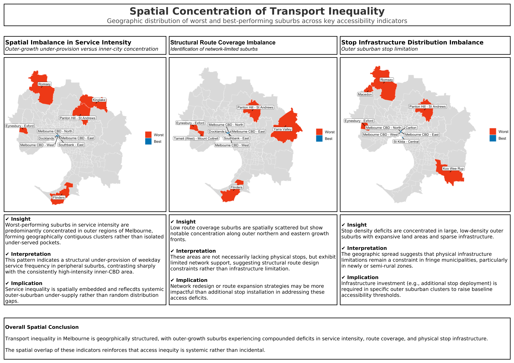

# Melbourne Public Transport Accessibility Analysis (2021 GTFS)

## 1. Project Overview
This project analyses structural inequality in Melbourne’s public transport network using suburb-level accessibility metrics derived from 2021 GTFS data.

Rather than relying solely on stop counts, the analysis integrates:

- Stop Density (infrastructure provision)
- Route Coverage (network penetration)
- Service Intensity (weekday service supply)

The objective is to quantify structural access gaps, identify under-served suburbs, and translate findings into decision-ready reporting outputs.

---

## 2. Business Problem
Public transport investment decisions are often made without a standardised, suburb-level accessibility framework.

This results in:

- Uneven service distribution across growth corridors
- Infrastructure-heavy but network-light configurations
- Suburbs with high population or land area but structurally limited connectivity

Stakeholders require data-backed evidence to prioritise intervention zones rather than relying on anecdotal infrastructure counts.

---

## 3. Analytical Objectives
1. Quantify suburb-level public transport accessibility
2. Identify bottom-quartile structural deficit zones
3. Compare stop density vs route coverage as drivers of service intensity
4. Translate technical findings into executive-ready visual reporting

---

## 4. Core Analytical Questions
#### Q1. Where are structural access deficits located?

Which suburbs fall into the bottom quartile for:

- Stop Density
- Route Coverage
- Service Intensity

Are deficits isolated or geographically concentrated?

#### Q2. Does stop abundance guarantee service intensity?

Is higher physical stop density associated with higher weekday service provision?

Does infrastructure presence equate to effective accessibility?

#### Q3. Which structural factor better explains service inequality?

Between:

- Stop Density
- Route Coverage

Which metric better explains variation in weekday service intensity?

---

## 5. Key Metrics

1. Stop Density

    &nbsp;Number of stops per km² within each SA2 suburb.
    &nbsp;Captures infrastructure concentration.

2. Service Intensity (Weekday Average)

    &nbsp;Average weekday stop-time events per km².
    &nbsp;Captures frequency and temporal supply.

3. Route Coverage

    &nbsp;Number of distinct routes serving each SA2 per km².
    &nbsp;Captures network penetration and diversity.

---

## 6. Methodology & Data Engineering

#### Database Construction
- PostgreSQL database environment setup
- GTFS dastaset ingestion and relational schema design
- ERD-based table normalisation
- Fact table creation for suburb-level metrics

#### Analytical Workflow
- Spatial joins (GTFS stops <-> SA2 boundaries)
- Aggregation queries using SQL
- Bottom-quartile thresholding
- Correlation and regression diagnostics
- Structured analytical reporting (poster format)

All metric calculatinos were implemented in SQL (PostgreSQL).

---

## 7. Structural Findings

### 7.1 Problem Identification (Poster 1)

Two distinct structural deficit patterns were identified:

**Infrastructure Deficit Zones**

- Extremely low stop density per km²
- Geographically concentrated in outer-growth suburbs

**Netowrk Coverage Gaps**
- Limited route penetration despite available infrastructure
- Network design limitations rather than stop scarcity

These suburbs represent priority intervention zones where baseline accessibility is structurally constrained.

### 7.2 Structural Drivers (Poster 2)

Correlation analysis shows:

- Route Coverage explains ~88% of variation in service intensity
- Stop Density explains ~57%

**Key Insight**:

Network structure is a stronger determinant of service intensity than physical stop abundance.

High stop density alone does not guarantee high service levels.
Connectivity and route penetration drive effective accessibility.

### 7.3 Spatial Evidence (Poster 3)

Spatial mapping reveals:

- Service intensity deficits cluster in outer-growth corridors
- Route coverage gaps appear along northern and eastern expansion fronts
- Stop density shortages are concentrated in low-density fringe municipalities

Transport inequality is geographically structured rather than randomly distributed.

Outer suburbs experience compounded structural disadvantages across multiple indicators.

---

## 8. Business Implications
- Infrastructure expansion alone is insufficient
- Network redesign and route penetration strategies may yield stronger impact
- Investment prioritisation should target structurally constrained growth corridors
- Accessibility policy should shift from asset-count metrics to network-efficiency metrics

This analysis supports evidence-based transport equity planning.

---
## 9. Deliverables
- SQL-based metric calculation scripts
- PostgreSQL relational schema & ERD
- Analytical poster series (Executive reporting format)
- Tableau dashboards & geospatial visualisations
- GitHub repository for reproducibility

---

## 10. Tech Stack
- PostgreSQL (data processing & aggregation)
- SQL (analytics & feature engineering)
- Tableau (executive dashboards)
- R (geospatial visualisation)
- GitHub (documentation & reproducibility)

---

## 11. Data Sources
- Public Transport Victoria (GTFS, 2021)
- ABS boundary data (SA2 / suburb level)

*Historical data used to demonstrate methodology and analytical capability.*

---

## Summary
This porject demonstrates:

- End-to-end analytica workflow design
- SQL-based metric enginerring at scale
- Structural inequality analysis
- Business-oriented rerporting & visual storytelling
- Translation of spatial analytics into policy-ready insight
